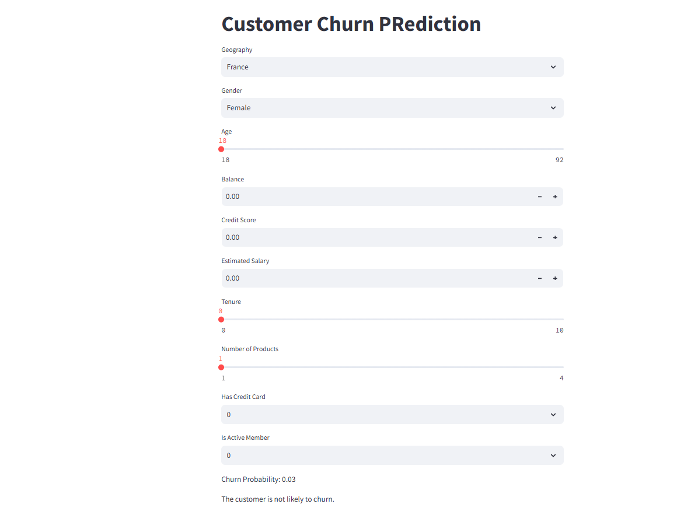

"""
# Customer Churn Prediction 🔮

This project is a Streamlit web application for predicting customer churn based on various customer attributes. The application uses a pre-trained TensorFlow model to provide the likelihood of a customer churning (leaving) based on attributes like geography, gender, age, balance, and more.

## Table of Contents
1. Project Overview
2. Features
3. Installation
4. Usage
5. Application Workflow
6. Project Structure
7. Dependencies
8. Example Screenshot
9. License
10. Acknowledgments

## Project Overview
The **Customer Churn Prediction** application is designed to help businesses identify which customers are more likely to churn based on specific characteristics. This insight allows companies to implement targeted strategies to retain customers and improve customer satisfaction. The application uses a TensorFlow deep learning model trained on historical data to predict churn probability.

## Features
- **User-Friendly Interface**: Intuitive input form to select customer attributes and view predictions.
- **Interactive Widgets**: Sliders, number inputs, and dropdowns for easy data entry.
- **Real-Time Prediction**: Provides the probability of churn along with a visual indicator of the likelihood.
- **Encodings and Scaling**: Automatically encodes categorical data and scales numeric data for accurate predictions.

## Installation

To run this application locally, you need to have **Python 3.7+** installed along with the necessary dependencies.

### 1. Clone the Repository

    git clone https://github.com/yourusername/customer-churn-prediction.git
    cd customer-churn-prediction

### 2. Install Required Packages

Install the required dependencies using `pip`:

    pip install -r requirements.txt

> **Note**: Ensure that the `model.h5`, `label_encoder_gender.pkl`, `onehot_encoder_geo.pkl`, and `scaler.pkl` files are located in the same directory as the script. These files are essential for encoding data and making predictions.

## Usage

To start the Streamlit app, run:

    streamlit run app.py

This will open the app in your default web browser. If it doesn’t open automatically, navigate to [http://localhost:8501](http://localhost:8501) in your browser.

## Application Workflow

1. **Select Input Data**:
   - **Geography**: Select the customer's region.
   - **Gender**: Select the customer’s gender.
   - **Age**: Set the customer’s age (slider from 18 to 92).
   - **Balance**: Enter the customer’s account balance.
   - **Credit Score**: Input the customer's credit score (a higher score typically indicates better creditworthiness).
   - **Estimated Salary**: Enter the customer’s estimated annual salary.
   - **Tenure**: Choose the number of years the customer has been with the company (slider from 0 to 10).
   - **Number of Products**: Select how many products the customer has purchased (1 to 4).
   - **Has Credit Card**: Select if the customer owns a credit card (0 for No, 1 for Yes).
   - **Is Active Member**: Select if the customer is an active member (0 for No, 1 for Yes).

2. **Prediction**: After entering all attributes, click the 'Predict Churn' button.

3. **Result Display**:
   - **Churn Probability**: The app displays a churn probability score (from 0 to 1) indicating the likelihood of customer churn.
   - **Interpretation**: Based on the probability, the app shows a message indicating whether the customer is likely to churn.

## Project Structure

The project directory is organized as follows:

    ├── app.py                   # Main Streamlit application file
    ├── model.h5                 # Pre-trained TensorFlow model file
    ├── label_encoder_gender.pkl # Label encoder for 'Gender' feature
    ├── onehot_encoder_geo.pkl   # One-hot encoder for 'Geography' feature
    ├── scaler.pkl               # StandardScaler for data normalization
    ├── requirements.txt         # Python package dependencies
    └── README.md                # Documentation file

## Dependencies

The `requirements.txt` file should contain the following dependencies:

    streamlit
    tensorflow
    scikit-learn
    pandas
    numpy

To install them, run:

    pip install -r requirements.txt

## Example Screenshot

## Acknowledgments

- **[Streamlit Documentation](https://docs.streamlit.io/)** - For app development and UI components.
- **[TensorFlow Documentation](https://www.tensorflow.org/api_docs)** - For deep learning model setup and integration.
- **[Scikit-Learn Documentation](https://scikit-learn.org/stable/documentation.html)** - For encoding and scaling utilities used in data preprocessing.

